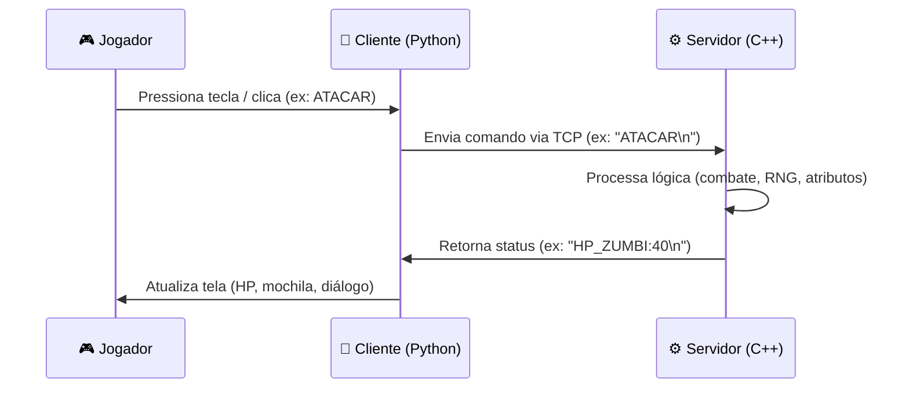

<div align="center">

# 🧟 Projeto RPG de Zumbi — POO

### Jogo de sobrevivência com arquitetura Cliente-Servidor


</div>

---

## 📋 Sumário

- [Sobre o Projeto](#-sobre-o-projeto)
- [Tecnologias](#-tecnologias)
- [Arquitetura do Projeto](#️-arquitetura-do-projeto)
- [Estrutura de Diretórios](#-estrutura-de-diretórios)
- [Fluxo de Comunicação](#-fluxo-de-comunicação-client-server)
- [Como Executar](#-como-executar)
- [Autores](#-autores)

---

## 📖 Sobre o Projeto

Este projeto é um **jogo de RPG de sobrevivência zumbi** com arquitetura Cliente-Servidor, desenvolvido como trabalho prático da disciplina de **Programação Orientada a Objetos (POO)** do curso de Engenharia da Computação da **UTFPR**.

O objetivo é aplicar, na prática, conceitos fundamentais de engenharia de software e redes no desenvolvimento de jogos — unindo um back-end robusto em C++ a uma interface gráfica em Python.

---

## 💻 Tecnologias

| Camada | Tecnologia | Função |
|---|---|---|
| **Back-end** | C++ (padrão C++17) | Motor do jogo, lógica de combate e regras de negócio |
| **Front-end** | Python 3 + Pygame | Interface gráfica, sprites e captura de eventos |
| **Redes** | `winsock2` (Sockets TCP) | Comunicação entre cliente e servidor |
| **Paradigmas** | POO (Encapsulamento, Herança, Polimorfismo) | Organização do código orientado a objetos |
| **Padrões de Projeto** | Factory Method | Criação de itens e personagens |

---

## 🏗️ Arquitetura do Projeto

O sistema foi estruturado de forma **modular e escalável**, separando as entidades do jogo em arquivos distintos e dividindo as responsabilidades entre lógica (servidor) e interface (cliente):

- 🖥️ **Back-end (C++)** — Motor do jogo que gerencia o servidor TCP, a lógica de combate, o RNG do mapa e as fábricas de itens e personagens. Separado estruturalmente em arquivos `.hpp` (declarações limpas) e `.cpp` (implementação e regras de negócio).
- 🎨 **Front-end (Python)** — Interface gráfica desenvolvida com Pygame (`cliente.py`) que captura eventos de teclado/mouse, exibe os elementos visuais (sprites, mapa, barras de HP) e gerencia a máquina de estados do jogo.
- 🌐 **Comunicação de Rede** — Ocorre via protocolo TCP, onde o Python atua como cliente enviando ações do jogador, e o C++ atua como servidor processando a lógica e devolvendo as respostas de status.

### 📂 Estrutura de Diretórios

```text
📁 Projeto_RPG/
├── 📁 Back/                  # BACK-END (C++) - Lógica e Regras de Negócio
│   ├── Servidor.cpp          # Arquivo principal que gerencia o loop do servidor TCP
│   ├── fabricas.hpp / .cpp   # Implementação do Design Pattern Factory Method
│   ├── 📁 Combate/           # Algoritmos de dano, turnos e atributos
│   ├── 📁 Itens/             # Classes de Armas, Alimentos e sistema de Mochila
│   ├── 📁 Mapa/              # Sistema de exploração e eventos aleatórios (RNG)
│   └── 📁 Personagem/        # Hierarquia de classes (Jogador, Atirador, Lutador, Zumbi)
│
└── 📁 front/                  # FRONT-END (Python) - Interface e Captura de Eventos
    ├── cliente.py            # Script principal do Pygame e gerenciador do Socket
    └── 📁 assets/            # Recursos visuais (cenários, sprites, UI)
```

---

## 🔄 Fluxo de Comunicação (Client-Server)

A arquitetura funciona através de uma troca constante de mensagens de texto formatadas via Sockets TCP:



| Etapa | Descrição |
|---|---|
| **1. Ação Visual** | O jogador interage com a interface em Python (ex: tecla `W` para explorar, clique em `ATACAR`) |
| **2. Envio da Ordem** | O cliente Python traduz a ação em uma string do protocolo (ex: `"ANDAR\n"`) e envia ao servidor na porta `5000` |
| **3. Processamento** | O servidor C++ recebe a string e invoca os métodos correspondentes (ex: sorteia um baú em `explorarMapa.cpp` ou resolve dano via a fachada de Combate) |
| **4. Devolução de Status** | O C++ atualiza os atributos em memória e devolve a resposta formatada (ex: `"BAU_CONTEUDO:Pistola\n"`) |
| **5. Renderização** | O Python intercepta a resposta e atualiza a tela (adiciona item à mochila, reduz a barra de HP, escreve na caixa de diálogo) |

---

## 🚀 Como Executar

### ✅ Pré-requisitos

- Compilador C++ (GCC/MinGW recomendado)
- Python 3 com a biblioteca **Pygame** instalada

### 1️⃣ Iniciar o Servidor C++

Abra o terminal na raiz da pasta do Back-end e compile todos os arquivos `.cpp` juntos, vinculando a biblioteca de sockets:

```bash
g++ -o meu_jogo.exe Servidor.cpp fabricas.cpp Combate/combate.cpp Itens/itens.cpp Itens/armas.cpp Itens/alimento.cpp Itens/mochila.cpp Mapa/explorarMapa.cpp Personagem/jogador.cpp Personagem/atirador.cpp Personagem/zumbi.cpp -lws2_32
```

Em seguida, inicie o servidor:

```bash
.\meu_jogo.exe
```

### 2️⃣ Iniciar o Cliente Python

Abra uma nova aba no terminal, navegue até a pasta do Front-end (onde estão `cliente.py` e a pasta `assets/`) e execute:

```bash
python cliente.py
```

> 💡 **Dica:** inicie sempre o servidor C++ primeiro — o cliente Python depende da conexão TCP já estar disponível na porta `5000`.

---

## 👥 Autores

| Nome | GitHub |
|---|---|
| _Luigi_ | [@lluiigi](#) |
| _Cleito_| [@jotta2300](#) |

---

<div align="center">

Feito com 🧟 e ☕ para a disciplina de POO — UTFPR

</div>
